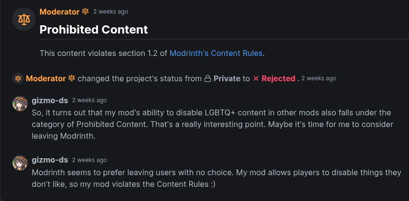

# Save My Shaky Network (1.21.1)

Block common mods from connecting to the internet without affecting the mods' functionality, preventing slow loading or
game crashes caused by network issues.

## Why This Mod Exists?

Because in certain regions with strict network censorship, accessing specific websites is impossible. For example, in
China, websites like Patreon and GitHub are blocked and cannot be accessed normally. However, some popular mods, such as
Quark, have included code that requests these websites, and when these requests fail, it can cause the game to stutter
or crash. These issues typically occur during server startup or when players join. This mod was created to solve this
problem by blocking such network requests, improving game stability for players in affected regions.

- [关于夸克模组一直尝试连接至Patreon的问题](https://www.bilibili.com/video/BV14E421u7Kt/)
- [解决Quark模组无法加载赞助者信息无限报错的问题](https://www.bilibili.com/read/cv13814407/)
- [Quark#3160](https://github.com/VazkiiMods/Quark/issues/3160)
- [Quark#3331](https://github.com/VazkiiMods/Quark/issues/3331)
- [Quark#3416](https://github.com/VazkiiMods/Quark/issues/3416)

A few months ago, I noticed that my Minecraft server was taking nearly 10 minutes to start each time. After
investigating, I discovered that Quark was causing this issue. Upon searching the issue tracker, I found that the author
of Quark refused to address this problem, which led me to develop this mod to resolve it.

## Modrinth?

Modrinth doesn't like this mod ¯\\\_(ツ)\_/¯

I don't think this mod violates the [Modrinth's Content Rules](https://modrinth.com/legal/rules).

## Features

For Forge/NeoForge: Set `versionCheck = false` in `config/fml.toml` to disable the loader's update checker.  
For Fabric with ModMenu: Set `"update_checker": false` in `config/modmenu.json` to disable ModMenu's update checks.

**NeoForge**

- [Nitrogen](https://github.com/The-Aether-Team/Nitrogen "1.20.1-1.0.11-neoforge") `氮` Disables supporters content for
  The Aether Team mods (e.g., disables MOA skins in The Aether);
- [Bagus Lib](https://www.curseforge.com/minecraft/mc-mods/bagus-lib "1.21.1-13.0.0") Blocks supporters info requests;
- [Blueprint](https://www.curseforge.com/minecraft/mc-mods/blueprint "1.21.1-8.0.0") Respects
  `slabfishSettings.enabled=false` to block unnecessary requests;
- [Exposure](https://www.curseforge.com/minecraft/mc-mods/exposure "1.9.5") Blocks golden camera skin requests;
- [M.R.U](https://www.curseforge.com/minecraft/mc-mods/mru "1.0.0+1.21-neoforge") Blocks API requests;
- [Immersive Engineering](https://www.curseforge.com/minecraft/mc-mods/immersive-engineering "1.21.1-12.1.0-185") Blocks
  special revolver skin requests;
- [Immersive Caves](https://www.curseforge.com/minecraft/mc-mods/immersive-caves "1.4.0") Blocks special revolver skin
  requests;
- [Inventory Profiles Next](https://www.curseforge.com/minecraft/mc-mods/inventory-profiles-next "neoforge-1.21-2.0.4")
  `一键背包整理Next` Disables update checks and telemetry requests;
- [Iris Shaders](https://www.curseforge.com/minecraft/mc-mods/irisshaders "1.8.0+1.21.1-neoforge") Blocks update
  requests;
- [Petrolpark Library](https://www.curseforge.com/minecraft/mc-mods/petrolpark-library "1.21.1-1.4.3") Blocks badge
  fetch requests;
- [Placebo](https://www.curseforge.com/minecraft/mc-mods/placebo "1.21-9.3.5") Blocks patron trail requests and patron
  wing requests;
- [Ribbits](https://www.curseforge.com/minecraft/mc-mods/ribbits "4.1.0") Blocks patron hat requests and No more Pride Month;
- [Supplementaries](https://www.curseforge.com/minecraft/mc-mods/supplementaries "neoforge_1.21-3.1.1") `锦致装饰`
  Prevents supporters info requests;
- [Titanium](https://www.curseforge.com/minecraft/mc-mods/titanium "1.21-4.0.12") `钛` Blocks reward requests;
- [Actually Additions](https://www.curseforge.com/minecraft/mc-mods/actually-additions "1.3.10") `实用拓展` Disables
  Special People Stuff;
- [Xaero's Minimap](https://www.curseforge.com/minecraft/mc-mods/xaeros-minimap "24.3.0_NeoForge_1.21") `Xaero的小地图`
  Disables update checks & patreon checks fetches;
- [Xaero's World Map](https://www.curseforge.com/minecraft/mc-mods/xaeros-world-map "1.39.0_NeoForge_1.21") `Xaero的世界地图`
  Disables update checks & patreon checks fetches;
- [ProjectE](https://www.curseforge.com/minecraft/mc-mods/projecte "1.0.1") `等价交换重制版` Blocks UUID check request;
- [Hexerei](https://www.curseforge.com/minecraft/mc-mods/hexerei "0.5.0.1") `魔法巫师` Blocks supporter requests;
- [Additional Structures](https://modrinth.com/mod/additional-structures "6.0.1") `失落废墟` Blocks supporter requests;
- [TenshiLib](https://www.curseforge.com/minecraft/mc-mods/tenshilib "1.8.2") Blocks patreon checks requests;
- [Ars Nouveau](https://www.curseforge.com/minecraft/mc-mods/ars-nouveau "5.9.4") `新生魔艺` Blocks reward requests;
- [Immersive Portals](https://www.curseforge.com/minecraft/mc-mods/immersive-portals-for-forge "6.0.6") `沉浸式传送门`
  Blocks mod info requests;
- [Quark](https://www.curseforge.com/minecraft/mc-mods/quark "4.1-466.3558") `夸克` Disables contributor list fetching
  on startup and player join. fewer celebrations;
- [Zeta](https://www.curseforge.com/minecraft/mc-mods/zeta "1.1-33.147") Block spam logs;
- [Kiwi Library](https://modrinth.com/mod/kiwi "15.7.5+neoforge") Blocks reward requests.

**Fabric**

- [Nitrogen](https://github.com/The-Aether-Team/Nitrogen "1.21.1-1.1.21-fabric") `氮` Disables supporters content for
  The Aether Team mods (e.g., disables MOA skins in The Aether);
- [Exposure](https://www.curseforge.com/minecraft/mc-mods/exposure "1.9.5") Blocks golden camera skin requests;
- [M.R.U](https://www.curseforge.com/minecraft/mc-mods/mru "1.0.0+1.21-fabric") Blocks API requests;
- [Inventory Profiles Next](https://www.curseforge.com/minecraft/mc-mods/inventory-profiles-next "fabric-1.21-2.0.4")
  `一键背包整理Next` Disables update checks and telemetry requests;
- [Iris Shaders](https://www.curseforge.com/minecraft/mc-mods/irisshaders "1.8.1+1.21.1-fabric") Blocks update requests;
- [Ribbits](https://www.curseforge.com/minecraft/mc-mods/ribbits "4.1.0") Blocks patron hat requests and No more Pride Month;
- [Supplementaries](https://www.curseforge.com/minecraft/mc-mods/supplementaries "fabric_1.21-3.1.1") `锦致装饰`
  Prevents supporters info requests;
- [Xaero's Minimap](https://www.curseforge.com/minecraft/mc-mods/xaeros-minimap "24.3.0_Fabric_1.21") `Xaero的小地图`
  Disables update checks & patreon checks fetches;
- [Xaero's World Map](https://www.curseforge.com/minecraft/mc-mods/xaeros-world-map "1.39.0_Fabric_1.21") `Xaero的世界地图`
  Disables update checks & patreon checks fetches;
- [TenshiLib](https://www.curseforge.com/minecraft/mc-mods/tenshilib-fabric "1.8.2.b") Blocks patreon checks requests;
- [Immersive Portals](https://www.curseforge.com/minecraft/mc-mods/immersive-portals-mod "6.0.6-mc1.21.1") `沉浸式传送门`
  Blocks mod info requests;
- [Kiwi Library](https://modrinth.com/mod/kiwi "15.1.5+fabric") Blocks reward requests.

## F.A.Q

1. Will XX Minecraft version be supported?  
   The author can only guarantee maintenance for current mainstream versions and versions the author actively plays.
2. Can I include `Save My Shaky Network` in a modpack?  
   ✅ Yes! It's recommended to
   use [Modrinth .mrpack](https://support.modrinth.com/en/articles/8802351-modrinth-modpack-format-mrpack) or CurseForge
   modpack ZIP format.  
   ❌ Do not directly include the mod binary (`.jar`) in your modpack—prioritize user security.
3. Add support for [I18nUpdateMod](https://github.com/CFPAOrg/I18nUpdateMod3)?  
   Never, I can't get a mod that needs a network to work after losing it. Maybe God can. 😇

## License

This mod is distributed under [MIT license](https://github.com/gizmo-ds/smsn-mod/blob/1.21.1/LICENSE)
